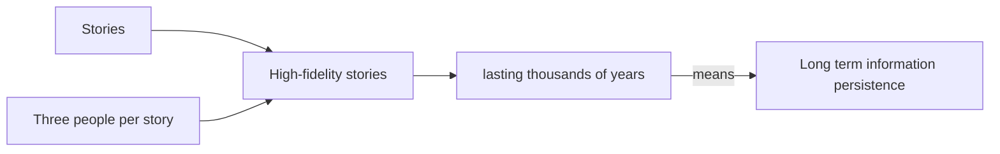

:::info

It is unlikely that humans are the first to develop story-based deep-time cultural information persistance on this planet.
:::

{/* `<image of black australian woman with painting>`
Caption: the greatest technology of humans
:::warn

Is this picture appropriate? Who to ask? Need a contact.
::: */}

## Problem: information degrades over time

Human-created and biologically-evolved information systems have overlapping problems and have developed similar solutions.

Hard-drives wear out, DNA sequences break and accumulate mutations, cosmic rays flib bits, DNA+RNA do not have 100% fidelity on copy, and so on.

`some cool pic here: stable diffusions???`

The solution is: `multiple copies`

While there are greater and lesser solutions at different stages and processes, duplication is the primary and most important mechanism for maintaining information consistency (right word?) over time.

Cloud data storage maintains multiple copies of the data in different locations so that the loss of a hard-drive unit (which happens at some frequency) is handled (mostly) automatically by software+hardware systems.

Biological systems use:
 - DNA is double-stranded (the spare strand can be used for fixing errors)
 - multiple copies of chromosomes
 - Species are populations with multiple copies

Cultural systems use:
 - writing
 - visual art
 - music and spoken word
 - places as physical anchors/markers/symbols
 - others?
 - digital storage of words, videos, sounds

We think of think of written words as having more durability than spoken word but:
 - languages evolve over time and reach a point where we cannot read the writing even if in stone (rosetta stone needed for Egyptian hieroglyphs)
 - written word is archival unless read or spoken
 - written/carved words can be burnt/destroyed/decayed by time

As long as the words (stories and songs) are spoken and sung in each generation, then the persistence is potentially forever.

Thus:

 - deep time cultures must minimize large-scale wars as these cause genocide and thus erasure of deep-time information
 - shallow-time cultures may not have the larger collective awareness of the long-term consequence of such loss events
 - parasitic elements of deep time entities can consume the stored entropy of complex information (akin to, or literally, burning books for warmth)
