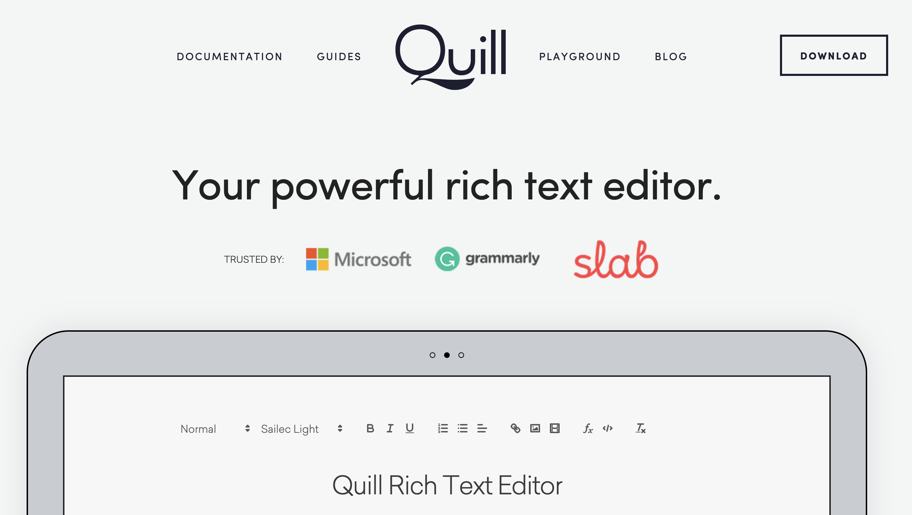
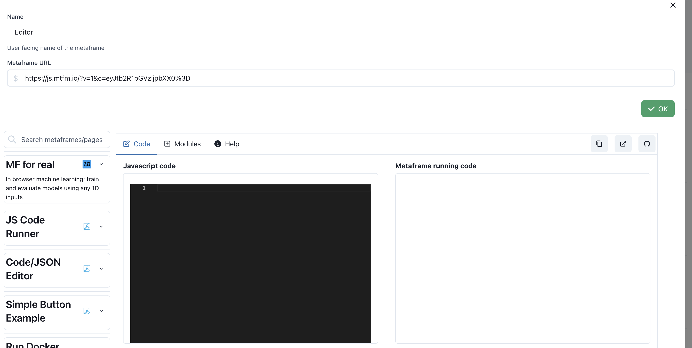
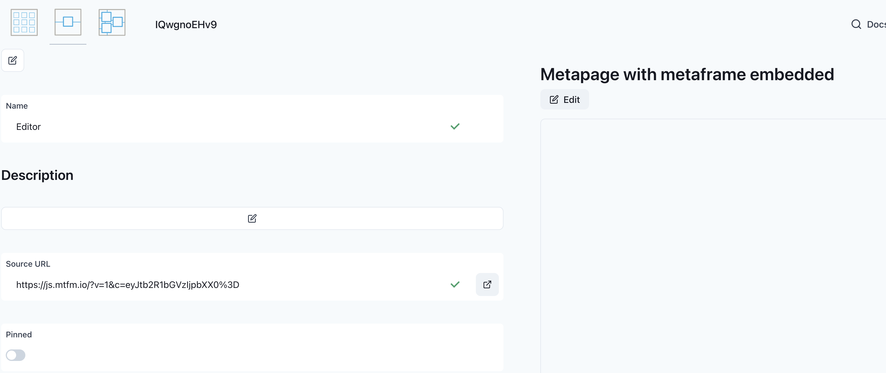
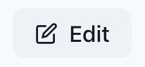
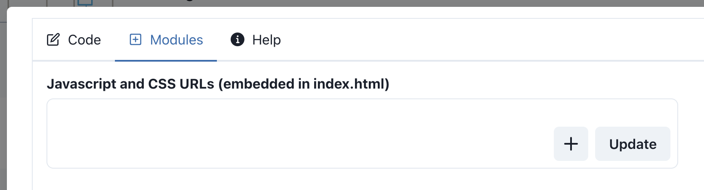
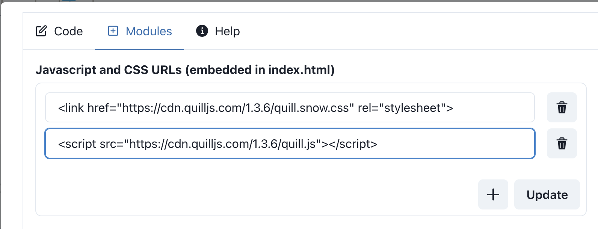
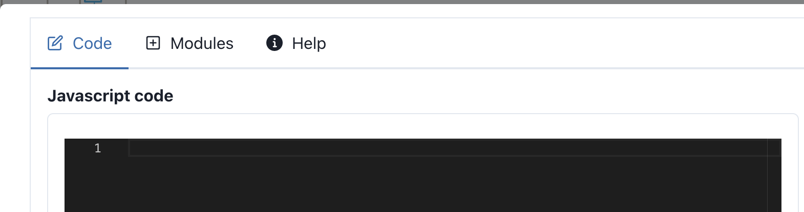
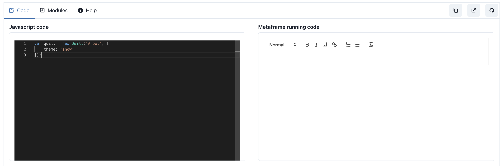

This example walks through adding a javascript text editor. It demonstrates how quickly you can:

 - add high-quality open-source code/tools/apps in a matter of minutes
 - add the resulting metaframe to your own metapage projects
 - connect this text editor and pipe the output elsewhere
 - share the metaframe with anyone

The example tool is a [quilljs](https://quilljs.com/), a high quality, open-soure text editor:

 [](https://quilljs.com/)

Let's add it as a metaframe

## Step 1: create a javascript metaframe

Click the `metaframe` icon (the single box):


Click `+ Create`

Give a name, e.g. "Text Editor"

In the search field:

 - type `js` or search for "JS Code Runner"
 - OR just enter the URL for the javascript metaframe: https://js.mtfm.io/

So you have something like:



And click "OK"

## Step 2: add the dependencies

You'll see the metaframe editor view:



We need to add the [quilljs](https://quilljs.com/) dependencies. They make it very easy with their [quickstart](https://quilljs.com/docs/quickstart/)

In the metaframe editor, click `Edit`



Click `+ Modules`



In a different tab, navigate to the [quickstart example](https://quilljs.com/docs/quickstart/)

We take the stylesheet and js module from the above example:

```html
    <!-- Include stylesheet -->
    <link href="https://cdn.quilljs.com/1.3.6/quill.snow.css" rel="stylesheet">
    <!-- Include the Quill library -->
    <script src="https://cdn.quilljs.com/1.3.6/quill.js"></script>
```

And paste them into the metaframe modules fields:



Click `Update`

## Step 3: Add javascript

Then click `Code`



Then paste the following:

```javascript
var quill = new Quill('#root', {
    theme: 'snow'
});
```

You should immediately see the text editor to the right:



This is good, but there's no saving or loading the text


## Also create from copying (part of) and existing
