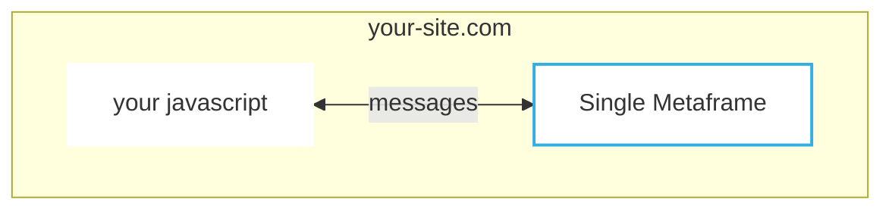

# Embed a metaframe on your site



(Check npm link)

Integrate single or multiple npm packages into your website as an alternative to typical `npm/yarn install` etc.

Integrate any [npm](https://npm.com)/javascript module


You see a metaframe with functionality you would like for your own site. With a few lines of code, you can integrate any of the large library of

Example:

:::warning
Implement example
:::

## Example: JSON editor as a react component

This is a minimal example in react, embedding the monaco (link) code editor configured for JSON.


```typescript
import { useCallback } from "react";
import { MetaframeStandaloneComponent } from "@metapages/metapage-embed-react";
import { MetaframeInputMap } from "@metapages/metapage";

export const EditorJson: React.FC<{
  content: string;
  onChange: (s: string) => void;
}> = ({ content, onChange }) => {
  const onOutputs = useCallback(
    (outputs: MetaframeInputMap) => {
      if (outputs["value"] === undefined || outputs["value"] === null) {
        return;
      }
      onChange(outputs["value"]);
    },
    [onChange]
  );

  return (
    <div>
      <MetaframeStandaloneComponent
        url="https://editor.mtfm.io/#?options=eyJhdXRvc2VuZCI6dHJ1ZSwiaGlkZW1lbnVpZmlmcmFtZSI6dHJ1ZSwibW9kZSI6Impzb24iLCJ0aGVtZSI6ImxpZ2h0In0="
        inputs={{ value: content }}
        onOutputs={onOutputs}
      />
    </div>
  );
};
```
## Use case

 - quickly integrate complex code into your main app
 - quickly experiment with different modules without requiring installation or rebuilding
   - some javascript modules, e.g. monaco, require custom complex build step (depending on your builder, webpack, vite, etc)


## Advantages

- the assets are not bundled with the main app, reducing build times and increasing download speed
- the editor can be easily configured via the URL
- the editor can easily be replaced without installing any additional modules
