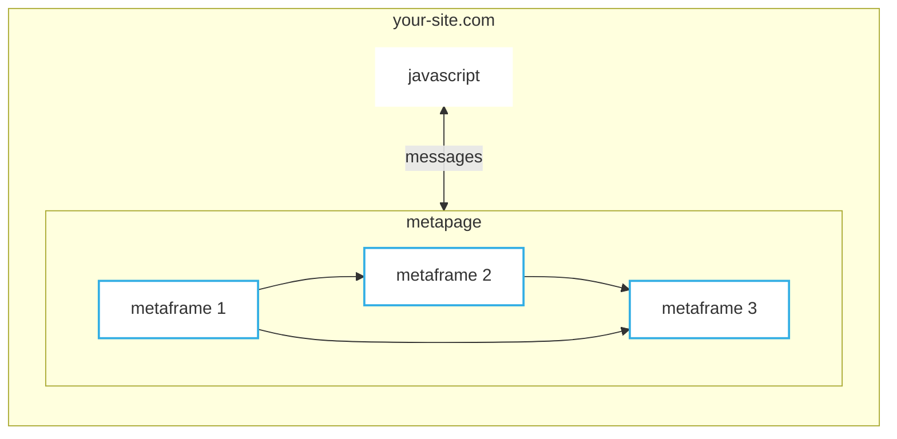

# Embed a metapage on your site

```mermaid
flowchart LR
    subgraph test [your-site.com]
        direction TB

        style js fill:#fff,stroke:#fff,stroke-width:2px
        style mf1 fill:#fff,stroke:#32AEE4,stroke-width:2px
        style mf2 fill:#fff,stroke:#32AEE4,stroke-width:2px
        style mf3 fill:#fff,stroke:#32AEE4,stroke-width:2px

        subgraph metapage [metapage]

            mf1[metaframe 1] --> mf2[metaframe 2]
            mf2 --> mf3[metaframe 3]
            mf1 --> mf3
        end
        js[ javascript] <--> |messages| metapage
    end
```

:::warning
Implement example
:::
