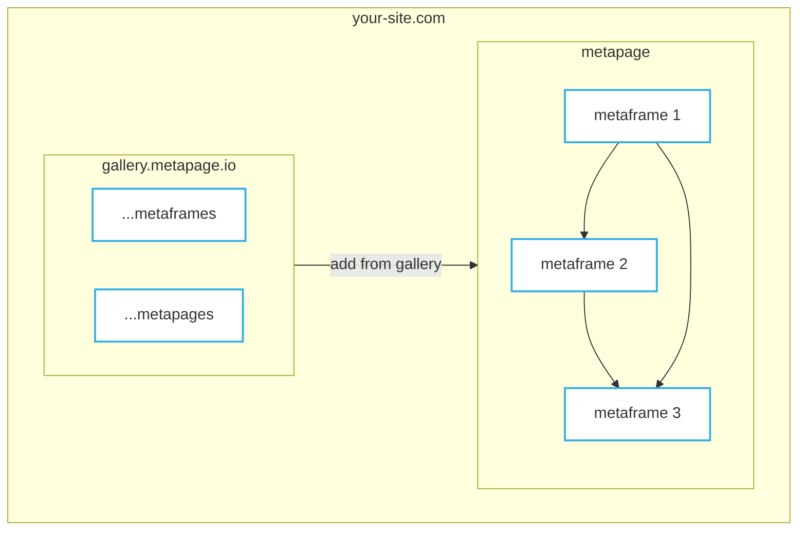

:::info
Adding a (custom) gallery into your own site requires a professional-level license
:::

```mermaid
flowchart LR
    style metaframes fill:#fff,stroke:#32AEE4,stroke-width:2px
    style metapages fill:#fff,stroke:#32AEE4,stroke-width:2px
    style mf1 fill:#fff,stroke:#32AEE4,stroke-width:2px
    style mf2 fill:#fff,stroke:#32AEE4,stroke-width:2px
    style mf3 fill:#fff,stroke:#32AEE4,stroke-width:2px

    subgraph test [your-site.com]
        direction LR

        subgraph gallery [gallery.metapage.io]
            direction LR
            metaframes[...metaframes]
            metapages[...metapages]
        end
        subgraph metapage [metapage]

            mf1[metaframe 1] --> mf2[metaframe 2]
            mf2 --> mf3[metaframe 3]
            mf1 --> mf3
        end

        gallery --> |add from gallery| metapage
    end
```
