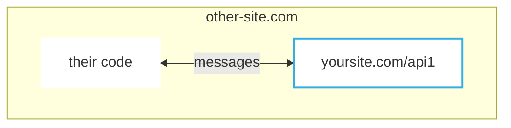
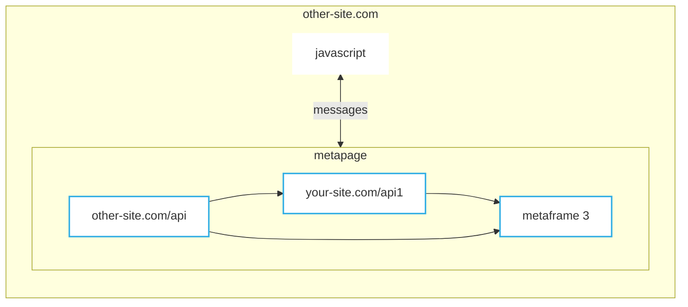
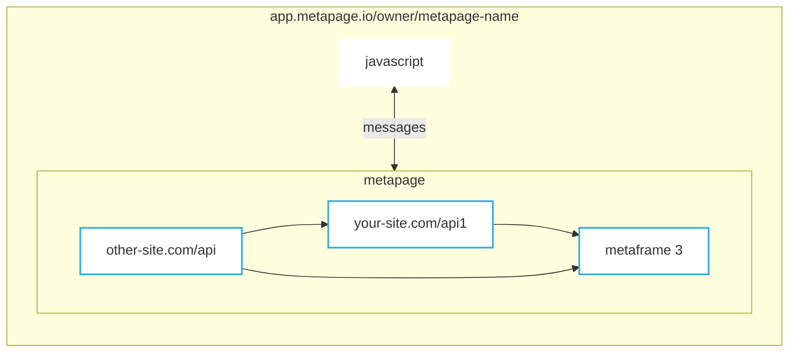

## Integrated simply as a metaframe

```mermaid
flowchart TD
    subgraph test [other-site.com]
        direction LR
        style js fill:#fff,stroke:#fff,stroke-width:2px
        style metaframe fill:#fff,stroke:#32AEE4,stroke-width:2px
        js[their code] <--> |messages| metaframe[yoursite.com/api1]
    end
```

## Integrated as a metapage in a third-party site

```mermaid
flowchart LR
    subgraph test [other-site.com]
        direction TB

        style js fill:#fff,stroke:#fff,stroke-width:2px
        style mf1 fill:#fff,stroke:#32AEE4,stroke-width:2px
        style mf2 fill:#fff,stroke:#32AEE4,stroke-width:2px
        style mf3 fill:#fff,stroke:#32AEE4,stroke-width:2px

        subgraph metapage [metapage]

            mf1[other-site.com/api] --> mf2[your-site.com/api1]
            mf2 --> mf3[metaframe 3]
            mf1 --> mf3
        end
        js[ javascript] <--> |messages| metapage
    end
```

## Integrated with a metapage @ app.metapage.io

```mermaid
flowchart LR
    subgraph test [app.metapage.io/owner/metapage-name]
        direction TB

        style js fill:#fff,stroke:#fff,stroke-width:2px
        style mf1 fill:#fff,stroke:#32AEE4,stroke-width:2px
        style mf2 fill:#fff,stroke:#32AEE4,stroke-width:2px
        style mf3 fill:#fff,stroke:#32AEE4,stroke-width:2px

        subgraph metapage [metapage]

            mf1[other-site.com/api] --> mf2[your-site.com/api1]
            mf2 --> mf3[metaframe 3]
            mf1 --> mf3
        end
        js[ javascript] <--> |messages| metapage
    end
```
