## Summary

:::info
Security and metaframes is an ongoing endeavour
:::

 - Currently no metaframes in the main gallery have an `OAuth` security layer.
 - There are some metaframes with hash token "authorization"

## Authentication/security mechanisms

 - None
 - X-Frame-Embed
 - OAuth (standard security mechanisms)
 - URL (hash param) tokens
 - Others

### None

Many (most) metaframes (websites) are not security/auth restricted.

 - The metaframe site only serves static assets
 - The user content is stored elsewhere e.g. in the URL hash parameters

### OAuth

This is one standard method of authentication. Websites using OAuth usually forbid being embedded as iframes (as metaframes are) to prevent click-jacking among other things.

:::warning
What recommendations here?
 - forbid the oauth flow if iframed, but otherwise allow iframes?
:::

### X-Frame-Embed

Allows metaframe sites to define which other sites can embed them.

:::info
Requires access to server configuration, at least for setting site response headers
:::

:::info
Only whitelists entire domains, not individual users
:::

#### Example: restrict domains where metaframe `your-site.com` can be embedded

Use case: metaframe `https://your-site.com` can only be embedded in a metapage served from `https://app.metapage.io` and `https://other-site.com`

This allows gated and controlled restrictions, for various business or other needs.

(Turn this into a table)

`other-site.com` allowed

```mermaid
flowchart LR
    subgraph test [other-site.com]
        direction LR

        style mf1 fill:#fff,stroke:#32AEE4,stroke-width:2px
        style mf2 fill:#fff,stroke:#32AEE4,stroke-width:2px
        style mf3 fill:#fff,stroke:#32AEE4,stroke-width:2px

        mf1["..."] --> mf2["✅ your-site.com"]
        mf2 --> mf3["..."]
        mf1 --> mf3
    end
```

`app.metapage.io` allowed

```mermaid
flowchart LR
    subgraph test [app.metapage.io]
        direction LR

        style mf1 fill:#fff,stroke:#32AEE4,stroke-width:2px
        style mf2 fill:#fff,stroke:#32AEE4,stroke-width:2px
        style mf3 fill:#fff,stroke:#32AEE4,stroke-width:2px

        mf1["..."] --> mf2["✅ your-site.com"]
        mf2 --> mf3["..."]
        mf1 --> mf3
    end
```

`every-other-site.com` **not** allowed

