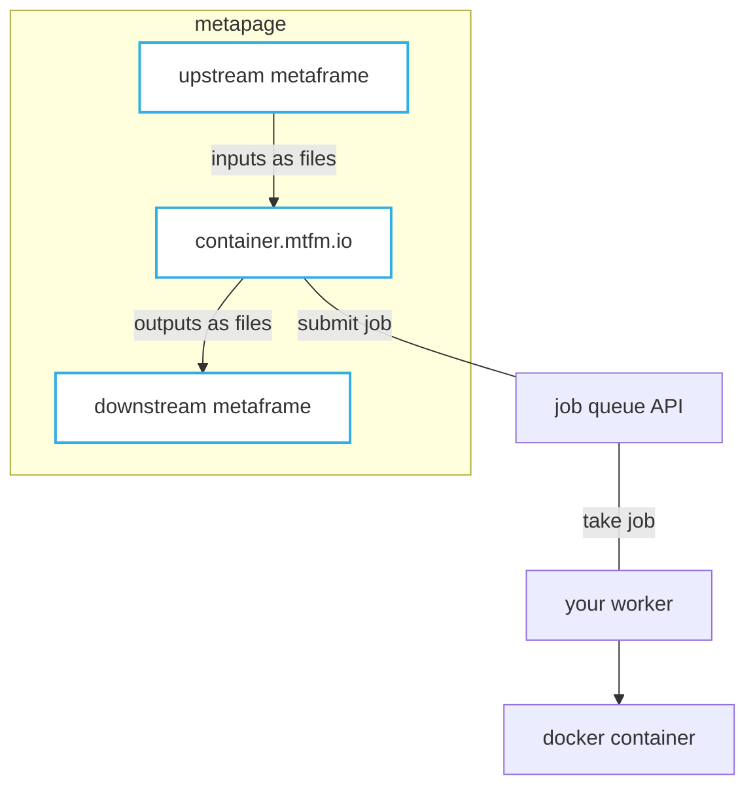

Container metaframes run any Docker image as a node in a metapage workflow. Inputs arrive as files; outputs are files written before the container exits. This enables any language or tool — Python, R, Julia, C++, WASM — to participate in a browser-based workflow.

Container metaframes are served at [`container.mtfm.io`](https://container.mtfm.io). The URL both defines the container configuration and acts as the metaframe endpoint.

## How it works



Each time inputs change, the container metaframe submits a job to the queue. A worker picks up the job, runs the container, and returns the output files.

## Container environment

### System environment variables

These are always available inside the container:

| Variable | Default | Description |
|---|---|---|
| `JOB_INPUTS` | `/inputs` | Directory where input files are mounted |
| `JOB_OUTPUTS` | `/outputs` | Directory where output files are read after exit |
| `JOB_CACHE` | `/job-cache` | Shared cache directory across jobs on the same worker |
| `JOB_ID` | sha256 of definition + inputs | Unique job identifier |
| `JOB_URL_PREFIX` | `https://container.mtfm.io/j/<jobId>` | Base URL for this job |
| `JOB_OUTPUTS_URL_PREFIX` | `https://container.mtfm.io/j/<jobId>/outputs/` | Public URL prefix for output files |
| `JOB_INPUTS_URL_PREFIX` | `https://container.mtfm.io/j/<jobId>/inputs/` | Public URL prefix for input files |
| `CUDA_VISIBLE_DEVICES` | — | GPU index, if assigned |

### User environment variables

All URL search parameters from the metaframe URL are injected as environment variables:

```
https://container.mtfm.io/#?MY_PARAM=hello
```

Makes `MY_PARAM=hello` available inside the container. This enables metapage-level URL parameters to flow into container configuration. See [URL parameters](/docs/url-parameters).

Reserved parameter names (cannot be overridden): `autostart`, `control`, `config`, `debug`, `definition`, `inputs`, `queueOverride`, `ignoreQueueOverride`, `job`, `queue`.

## Inputs and outputs

- Place output files in `/outputs/` before the container exits — the worker reads this directory when the container finishes successfully
- Input files are available in `/inputs/` at runtime
- The `$JOB_CACHE` directory persists across jobs on a single worker instance (not shared between workers) — use it to cache large models or datasets

```python
# Example: read input, write output
import json, os

input_path = os.path.join(os.environ["JOB_INPUTS"], "data.json")
output_path = os.path.join(os.environ["JOB_OUTPUTS"], "result.json")

with open(input_path) as f:
    data = json.load(f)

result = {"count": len(data)}

with open(output_path, "w") as f:
    json.dump(result, f)
```

## Caching

The `$JOB_CACHE` directory is shared between all jobs running on the same worker. Use it for:
- Large ML models (download once, reuse across jobs)
- Pip/conda environments
- Large reference datasets

The cache is not guaranteed to persist if the worker restarts.

## Security

- Container jobs have no host network access
- Only `/inputs` and `/outputs` are mounted from the host
- The queue ID is the access credential — treat it as a secret

## Running workers

See [Deploy: Local mode](/docs/container-local-mode) and [Deploy: Remote mode](/docs/container-remote-mode) for how to run workers.

## GitHub

[`metapages/compute-queues`](https://github.com/metapages/compute-queues)
