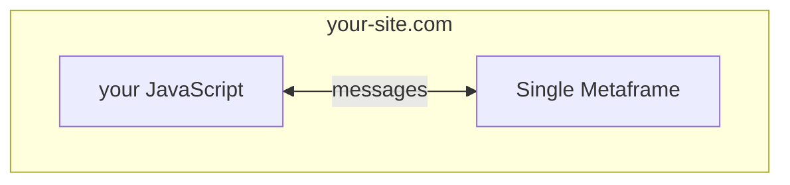

Metapages can be embedded in any web application. The metapage library renders iframes, handles all message routing, and exposes a simple API to exchange data with your application code.

## Vanilla JS

The minimal integration — no framework required:

```javascript
import { renderMetapage } from "@metapages/metapage";

// Fetch or construct a definition
const definition = await fetch("https://metapage.io/m/<id>/metapage.json").then(r => r.json());

const { setInputs, dispose } = await renderMetapage({
  definition,
  rootDiv: document.getElementById("metapage-container"),
  onOutputs: (outputs) => {
    // outputs: { [metaframeKey]: { [outputName]: value } }
    console.log("outputs", outputs);
  },
  options: {
    hideBorder: true,
    hideFrameBorders: true,
    hideOptions: true,
    hideMetaframeLabels: true,
  },
});

// Push data into the workflow
setInputs({ inputName: "value" });

// Remove iframes and clean up
dispose();
```

## CDN (no build step)

```html
<!DOCTYPE html>
<html>
<body>
  <div id="metapage-container" style="width:100%;height:600px;"></div>
  <script type="module">
    import { renderMetapage } from "https://cdn.jsdelivr.net/npm/@metapages/metapage@latest/+esm";

    const definition = await fetch("https://metapage.io/m/<id>/metapage.json").then(r => r.json());

    const { setInputs, dispose } = await renderMetapage({
      definition,
      rootDiv: document.getElementById("metapage-container"),
      onOutputs: (outputs) => console.log("outputs", outputs),
    });
  </script>
</body>
</html>
```

## React

See [React SDK](/docs/react-sdk) for component-based embedding with `MetapageGridLayoutFromDefinition` and `MetaframeStandaloneComponent`.

## Embedding a single metaframe (without a metapage)

You can embed a single metaframe URL directly — useful when you only need one component and want to manage I/O in your own application code:



With React:

```tsx
import { MetaframeStandaloneComponent } from "@metapages/metapage-embed-react";

<MetaframeStandaloneComponent
  url="https://plot.mtfm.io/"
  inputs={{ data: myData }}
  onOutputs={(outputs) => handleOutputs(outputs)}
/>
```

## Security

Metaframes are cross-origin iframes. They cannot access your application's JavaScript context or DOM. The only communication channel is the structured `postMessage` protocol managed by the metapage library. This means:

- Third-party metaframes cannot read your page's state
- Malicious code in a metaframe is sandboxed
- You control which metaframes are loaded and what data they receive
