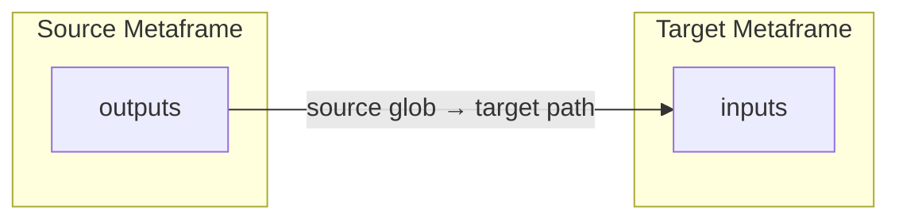

Data connections define how outputs from one metaframe become inputs to another. Connections are declared in [`metapage.json`](/docs/metapage-json) or configured via the metapage editor.



## Connection parameters

A connection has two optional parameters:

1. **Source glob** — which outputs to forward from the source. Empty or `**` means all outputs.
2. **Target path** — how to name/place the data in the target. Empty means keep the original path.

## Output filtering (source glob)

The source glob uses [glob pattern](https://code.visualstudio.com/docs/editor/glob-patterns) matching:

| Pattern | Description | Example match |
|---|---|---|
| `**` or empty | All outputs | Everything |
| `*.json` | Files with specific extension | `data.json` but not `data/info.json` |
| `**/*.json` | Extension in any directory | Both `data.json` and `data/info.json` |
| `data/*` | Files in a specific directory | `data/file.txt` but not `data/sub/file.txt` |
| `**/report*` | Name pattern in any directory | `report.csv`, `data/report_final.pdf` |

Filter behavior examples:

| Output name | Filter | Forwarded? |
|---|---|---|
| any | (empty) | ✅ |
| any | `**` | ✅ |
| `foo.bar` | `*.bar` | ✅ |
| `dir1/foo.bar` | `*.bar` | ❌ |
| `dir1/foo.bar` | `**/*.bar` | ✅ |
| `dir1/foo.bar` | `**/foo*` | ✅ |

## Input mapping (target path)

| Type | Definition | Result |
|---|---|---|
| Empty | Leave target path empty | Files keep their original names and paths |
| Directory prefix (ends with `/`) | e.g. `incoming/` | Files are placed under that directory in the target |
| File rename (no trailing `/`) | e.g. `result.csv` | Source output is renamed to this name |

## Full examples

| Connection | Source output | Target input | Description |
|---|---|---|---|
| `*.json → data/` | `results.json` | `data/results.json` | Send all JSON to a folder |
| `report.csv → summary.csv` | `report.csv` | `summary.csv` | Rename a specific file |
| `** →` (empty) | `data/file.txt` | `data/file.txt` | Pass through unchanged |
| `**/*.csv → reports/` | `june/sales.csv` | `reports/june/sales.csv` | Nested CSV to folder |

## Data types by metaframe type

### Container (Docker) metaframes

Container inputs and outputs are files:
- Inputs arrive at `/inputs/` inside the container (`$JOB_INPUTS`)
- Outputs are read from `/outputs/` when the container exits (`$JOB_OUTPUTS`)
- Large files are stored in cloud storage; only a reference URL is routed through the message layer

### JavaScript metaframes

JavaScript frames send and receive values directly via the metapage module API:

```javascript
// Receive inputs
export function onInputs(inputs) {
  const value = inputs["myKey"];   // inputs is a plain object
}

// Send a single output
setOutput("result", 42);

// Send multiple outputs
setOutputs({
  result: true,
  data: [1, 2, 3],
});
```

Supported output types: strings, numbers, booleans, JSON objects/arrays, `ArrayBuffer`, typed arrays, `File`, `Blob`.
