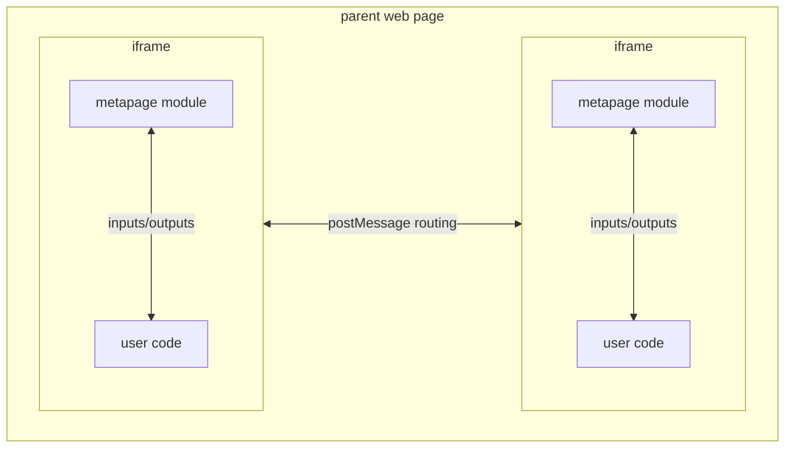
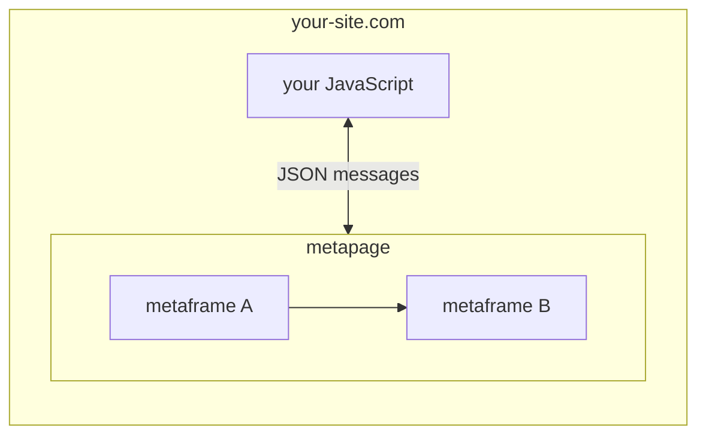

## Metaframes

A **metaframe** is any web page that uses the `@metapages/metapage` npm module to communicate structured data with a parent document. The module handles the postMessage protocol; user code only needs to call `setOutput()` and export `onInputs()`.

Any URL can be a metaframe. If it integrates the module, it becomes a connectable component that can participate in a metapage workflow. Metaframes are isolated by browser security — cross-origin iframes cannot access each other's DOM or the parent page's JavaScript context.



## Metapages

A **metapage** is a JSON-defined graph of metaframes. The metapage library runs in the parent document and is responsible for:

- Loading each metaframe as an iframe
- Routing outputs from one metaframe to inputs of another per the connection graph
- Exposing `setInputs()` and `onOutputs()` to the embedding application

```mermaid
flowchart TB
  subgraph page [Metapage (parent document)]
    router[Message routing layer]
    subgraph mf1 [Metaframe A]
      client1[metapage module]
    end
    subgraph mf2 [Metaframe B]
      client2[metapage module]
    end
    subgraph mf3 [Metaframe C]
      client3[metapage module]
    end
    client1 <--> router
    client2 <--> router
    client3 <--> router
  end
```

## Message routing

Data flows through the parent page's routing layer:

1. Metaframe A calls `setOutput("key", value)` — the module serializes and posts the message to the parent
2. The routing layer evaluates the connection graph to find targets subscribed to Metaframe A's outputs
3. Matched outputs are forwarded to the target metaframe's inputs via `postMessage`

The parent never shares its JavaScript context with iframes, and iframes never communicate directly with each other.

## Data types

**JavaScript metaframes** can send and receive:
- Strings, numbers, booleans
- JSON objects and arrays
- `ArrayBuffer`, typed arrays
- `File`, `Blob`

**Container metaframes** communicate via the filesystem:
- Inputs arrive as files in `/inputs/`
- Outputs are files written to `/outputs/`
- Large data is stored in cloud storage and referenced by URL; only the reference is sent through the message routing layer

## Security model

- Iframes run in separate browser security contexts; cross-origin frames cannot read each other's DOM
- The parent controls which messages are routed and to whom
- Container jobs have no host network access and only mount `/inputs` and `/outputs`
- Each queue ID is an unguessable random string — possession of the ID is the access credential

## Embedding in your application

Your application can host a metapage, intercept all outputs, and inject inputs:



See [Embed a metapage](/docs/embed) for implementation details.

## URL structure

**Metapages** on metapage.io:
```
https://metapage.io/<username>/<human-readable-slug>-<guid>
```
The 32-character hex GUID at the end is the canonical identifier. The human-readable prefix is display-only and ignored for resolution.

**Metaframes** on metapage.io:
```
https://metapage.io/mf/<metaframe-id>
```

**Fetching a metapage definition** (public/archived):
```
https://metapage.io/m/<guid>/metapage.json
```
