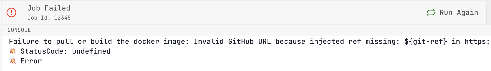

# You are missing a URL parameter that sets the `git-ref` for a container metaframe {#187018579bb58087ab2fd2db65739608}


See full [documentation](/docs/git-refs-in-urls).


If you see something like this error:





Then add e.g. `git-ref=main` (or whatever tag or branch you want) to your metapage URL, e.g.


```shell
https://metapage.io/dion/dev-github-ref-c121806128c54f89b44e2af9a176bd9b?git-ref=main
```


See full [documentation](/docs/git-refs-in-urls).

