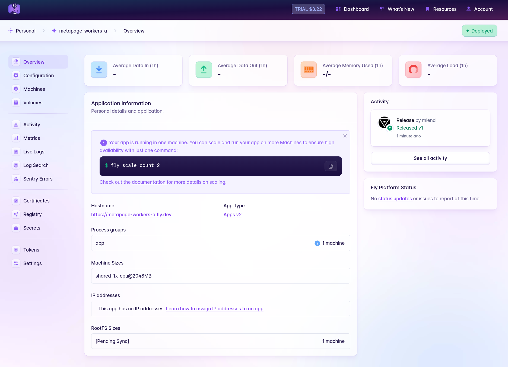
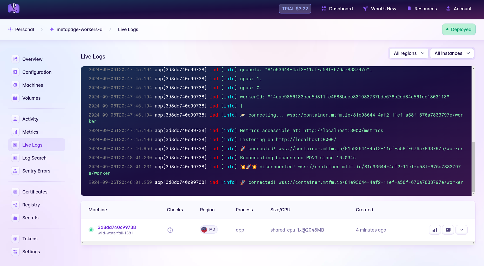

# Deployment on Fly.io {#f71aa082c32c49d1a43a8add8fbca628}


[Fly.io](http://fly.io/) is an accessible, straightforward cloud platform where you can deploy and manage full-stack VMs with the convenience of containers. Metapage workers can be deployed on Fly by defining and launching a couple of Fly apps.


## Prerequisites {#f58f1df8856f4eeebe706cccae23e8cc}

- A [Fly.io](http://fly.io/) account, of course
- The [flyctl](https://fly.io/docs/flyctl/install/) command line utility
- A random queue ID that the Metapage workers use to listen and receive jobs. This queue ID will need to be provided to both the deployed workers and the metaframe you want them processing jobs for.
	- If you’re on MacOS or Linux, you should be able to generate a UUID with the `uuid` command, and this suits the case perfectly.

Deploy the worker app


Fly apps are usually defined with a TOML configuration file. Copy the following Fly TOML config to a file named `workers-a.fly.toml`. Replace `MyOrg` with a unique name to prefix your app with — your actual Fly Organization name is a good choice for this. If you’re just using a personal account, this is probably your username. Run `fly orgs list` to show your orgs.


```toml
# See https://fly.io/docs/reference/configuration/ for information about how to use this file.

app = 'MyOrg-metapage-workers-a'
primary_region = 'ord'

[build]
  image = 'metapage/metaframe-docker-worker:latest-standalone'

# This example uses 2CPU/4GB RAM machines with an attached L40S GPU. These can
# get pricey, so make sure it's not sticking around when you don't need it!
# (Check the section on autoscaling below for more)
[[vm]]
  memory = '4gb'
  cpu_kind = 'performance'
  cpus = 2
  size = 'l40s'

[env]
  METAPAGE_IO_CPUS = 2
  METAPAGE_IO_GPUS = 1
  METAPAGE_IO_WORKER_RUN_STANDALONE = true

[[restart]]
  policy = "on-failure"
  retries = 10
```


### Hey, what is this TOML file doing? {#7733defd882c43879c1aca35bd0f9fad}


	If you prefer to sink your teeth deep into the fly app configuration features immediately, you can check out the [full fly.toml app configuration doc](https://fly.io/docs/reference/configuration/). Otherwise, let’s step through the above file’s contents to explain what each section is doing.


	The `primary_region` defines what geographical region machines will be created in by default. `ord` is the code for Chicago, Illinois, chosen here because it’s the only region with L40S GPUs available at time of writing. If you want to change this, you can run `fly platform regions` or check the [Regions documentation](https://fly.io/docs/reference/regions/) to see the extensive list of possible regions to run your workers.


	This just tells Fly that we want to use the latest “standalone” version of the metapage worker image from Docker Hub. The standalone image provides its own container daemon rather than relying on the host to provide one.


	This section defines some of the compute capabilities we’re reserving. In this case, 2 dedicated CPU cores, 4GB of RAM, and an Nvidia L40S GPU attached. You can get a look at what CPU/RAM/GPU options are available on Fly’s [pricing page](https://fly.io/docs/about/pricing/), and see the [VM section](https://fly.io/docs/reference/configuration/#the-vm-section) of the configuration docs for the keywords to configure the machines to your liking.


	`METAPAGE_IO_GPUS` does ditto for GPUs. We have 1, so we set this to `1`.


	`METAPAGE_IO_WORKER_RUN_STANDALONE` is an option made available for environments that don’t provide a running docker daemon for the metapage worker. The non-standalone version of the worker expects such a daemon to be accessible, but this option tells the worker to provide _its own_ container runtime instead.


	This tells fly that if our worker exits normally, we can leave it `stopped` , but if it crashes, we should restart it. It will try to restart 10 times before giving up if issues persist.


We’ll stage a secret for the app before we deploy its full configuration, so first create an empty app:


```bash
fly apps create MyOrg-metapage-workers-a 
```


(don’t forget to replace MyOrg with your unique prefix)


Then set a secret on the app, using the metapage queue ID specified in the [Prerequisites](/docs/container-provider-flyio#f58f1df8856f4eeebe706cccae23e8cc):


```bash
fly secrets set -a MyOrg-metapage-workers-a METAPAGE_IO_QUEUE=[MyGeneratedQueueId]
```


We’re ready to deploy the worker! Run: 


```bash
fly deploy -c workers-a.fly.toml --yes --ha=false
```


This will deploy the new app with the file’s definition, accept all the usual prompts, and prevent deploying in High Availability mode (in other words, it will create 1 VM instead of 2).


Once it finishes, you should be able to see your app in the Fly dashboard. Take a peek:





It looks like the worker is deployed and running, but check out the logs (under `Live Logs`) to make sure it’s successfully connected to its queue.





You can also follow the app logs from the command line at any time with `fly logs -a MyOrg-metapage-workers-a`.


## Scale the workers {#e483fac6e3864e15ad1eb91a094feb75}


Adjusting the number of worker machines by hand is easy. If you want 2 workers, just run `fly scale count 2 -a MyOrg-metapage-workers-a`. The same works for 4, 10, or 0.


You can look at the machines you just created either in the web UI or with `fly machines list -a MyOrg-metapage-workers-a`.


## _Auto_-scale the workers {#8e81556971984e71ac4568c5aec1dc5d}


You might want a lot of workers, but you don’t want to play with the numbers by hand. It’s error-prone, and forgotten machines can run up a bill. We can auto-scale instead (including scale-to-zero) by deploying a couple other small apps.


### Metrics proxy {#06965f4f4d3c42e898c64c1c17bd03f6}


[Fly Metrics Proxy](https://github.com/miend/fly-metrics-proxy) is a simple service for forwarding Prometheus-compatible metrics to Fly.io’s managed Prometheus service. It listens for requests to its `/metrics` endpoint, and then in turn fetches a number of other metrics from external endpoints we define, aggregates them, attaches additional labels, and sends them all back to Fly. This will let us provide Fly with metrics about our job queue(s) from Metapage’s API to determine whether we should spin more workers up or down.


You’ll need that Queue ID handy which you generated earlier for the original worker deployment. Then, copy the below config to a file named `metrics-proxy.toml`, replacing `MyOrg` with your org name:


```toml
app = 'MyOrg-metrics-proxy'
primary_region = 'ord'

[build]
	# TODO: If we can host/mirror this in metapage's docker, replace below line!
  image = 'docker.io/michaelendsley/fly-metrics-proxy:latest'

[env]
  METRICS_TARGETS = """
[
  {
    "endpoint": "https://container.mtfm.io/MyGeneratedQueueID/metrics",
    "app_name": "MyOrg-metapage-workers-a"
  }
]
"""

[[vm]]
  memory = '256mb'
  cpu_kind = 'shared'
  cpus = 1

[metrics]
  port = 8080
  path = '/metrics'
  https = false
```


This app will listen for requests to `/metrics` from Fly, and will in turn reach out to the Metapage public API for your job queue’s metrics (we provide a single metric of `queue_length`), attach a label “app_name” to it, and return it to Fly in its response.


You don’t need to do any special setup for this app. Just use this command to get it running:


```shell
fly launch -c metrics-proxy.toml --copy-config --yes --ha=false
```


If you want to confirm that it’s doing what it should (beyond looking at the app logs), the [Fly.io](http://fly.io/) dashboard has a `Metrics` section that takes you to a provided Grafana dashboard. You can explore metrics there to find your `queue_length` metric, with a label `app_name` equal to your Fly worker app’s name.


### Autoscaler {#08f9793fd7704349917da275cbdb278d}


Next, we’ll use [Fly Autoscaler](https://github.com/superfly/fly-autoscaler) which can leverage the metrics we just provided to scale the worker app. Actually, it can scale more than 1 set of workers, but more on that below.


Copy the below config to a file named `autoscaler.fly.toml`:


```toml
app = "MyOrg-metapage-autoscaler"

[build]
image = "flyio/fly-autoscaler:0.3.1"

[env]
FAS_APP_NAME = "MyOrg-metapage-workers-a"
FAS_STARTED_MACHINE_COUNT = "ceil(queue_length / 1)"
FAS_PROMETHEUS_ADDRESS = "https://api.fly.io/prometheus/MyOrg"
FAS_PROMETHEUS_METRIC_NAME = "queue_length"
FAS_PROMETHEUS_QUERY = "sum(queue_length{app='$APP_NAME'})"

[metrics]
port = 9090
path = "/metrics"
```


Don’t forget to replace instances of `MyOrg` with your org name!


### Alright, what is _this_ TOML file doing? {#187cba7f2fac4431ad7d602eb0439522}


	Ignoring the parts already explained before in the `workers-a.fly.toml`, this just defines a few Fly Autoscaler-specific environment variables.


	`FAS_APP_NAME` sets the name of the app(s) targeted for autoscaling. This supports wildcard matches, but right now we’re looking for the exact name of our worker app.


	`FAS_STARTED_MACHINE_COUNT` is an [Expr](https://expr-lang.org/docs/language-definition) language expression defining how many machines in our app’s current pool of machines should be in a _started_ state. These are the ones for which you’ll be charged CPU/GPU & RAM by Fly, as long as they’re running. This expression says that our machine count should be the same number of jobs in the queue. If we assumed each worker could handle 2 jobs from the queue instead of 1, it could become `ceil(queue_length / 2)`. If we wanted one worker always online, it could be `ceil(queue_length / 2) + 1`, and so on.


	`FAS_PROMETHEUS_ADDRESS` , `FAS_PROMETHEUS_METRIC_NAME` , and `FAS_PROMETHEUS_QUERY` all relate to the query the autoscaler is making from the Fly-managed Prometheus instance provided for each org. `queue_length` is the metric provided by the metapage worker representing queue jobs not in a `Finished` state.


Just as we did with the worker app, we’ll create an empty app for the autoscaler first, then set a couple of secrets before we deploy it.


```bash
fly apps create MyOrg-metapage-autoscaler
```


Create a deploy token for your worker app, which will give Fly Autoscaler permission to perform scaling operations on it:


```bash
fly tokens create deploy -a MyOrg-metapage-workers-a
```


Set the value of this as a secret on the autoscaler:


```bash
fly secrets set -a MyOrg-metapage-autoscaler FAS_API_TOKEN="[deploy token value]"
```


Create a read-only token that will let the autoscaler read from your org’s managed Prometheus endpoint:


```bash
fly tokens create readonly MyOrg
```


And set this as a secret, too:


```bash
fly secrets set -a my-autoscaler FAS_PROMETHEUS_TOKEN="[readonly token value]"
```


Finally, deploy the autoscaler:


```bash
fly deploy -c autoscaler.fly.toml --ha=false
```


The option `--ha=false` prevents the autoscaler from launching with more than 1 machine in its app.


At this point, the autoscaler should spin up and start evaluating the `queue_depth` metric and determining if it needs to start or stop any worker machines in your deployed app. The limit on the number of machines that can be started is simply the scale of your app. If you currently have just 1 machine running in your worker app, try running `fly scale count 5 -a MyOrg-metapage-workers-a`.


If you have no active jobs in the queue, you should see a number of machines spin up at first, and then the autoscaler will begin stopping them as part of its reconciliation loop. In short order you’ll be left with 5 `Stopped` machines.


If 5 or more unfinished jobs stick around the metapage queue for your workers, then you should see the number of `Running` machines automatically scale up to the limit (5), and drop again once enough jobs are processed.


## Deploy and scale workers on multiple queues {#c430c95b5c2f494a9419b399f7d11dd5}


If you want to process jobs on multiple queues, you’ll need multiple worker apps to match. You can, for example, `cp workers-a.fly.toml workers-b.fly.toml` and modify the contents to end up with something like this:


```toml
# See https://fly.io/docs/reference/configuration/ for information about how to use this file.

app = 'MyOrg-metapage-workers-b'
primary_region = 'ord'

[build]
  image = 'metapage/metaframe-docker-worker:latest-standalone'

[[vm]]
  memory = '2gb'
  cpu_kind = 'shared'
  cpus = 2

[env]
  METAPAGE_IO_CPUS = 2
  METAPAGE_IO_WORKER_RUN_STANDALONE = true

[...redundant parts snipped...]
```


Deploy this one just like before, by first creating the empty app and setting its `METAPAGE_IO_QUEUE` as a secret, and then using `fly deploy [...]` . You should now have two worker groups running.


### Update the metrics proxy {#5da3c3cc3cac495caca1b77d126e1d36}


Your metrics proxy should be requesting metrics for your first job queue, but now that you’re adding a second set of workers, you’ll want to update it so it fetches the metrics for that too. In `metrics-proxy.toml`, change the environment variable `METRICS_TARGETS` like so:


```toml
[env]
  METRICS_TARGETS = """
[
  {
    "endpoint": "https://container.mtfm.io/MyGeneratedQueueID/metrics",
    "app_name": "MyOrg-metapage-workers-a"
  },
  {
	  "endpoint": "https://container.mtfm.io/MySecondQueueID/metrics",
	  "app_name": "MyOrg-metapage-workers-b"
	}
]
"""
```


Deploy with a `fly deploy -c metrics-proxy.toml --ha=false`, and the metrics proxy will begin forwarding metrics for both of your queues.


### Update the autoscaler {#5885df5be6e64e49a34952cba12ec5c4}


If you stuck with the naming scheme presented in this doc, adding this new worker app to the autoscaler config is straightforward as well. You’ll only need two changes to your `autoscaler.fly.toml` , both of them under the `[env]` section:


```toml
[env]
FAS_APP_NAME = "MyOrg-metapage-workers-*" # this one is changed
FAS_ORG = "MyOrg" # this one is new
```


`FAS_APP_NAME` is defined here with a wildcard. The autoscaler will look for any apps matching that wildcard pattern (in this case both `a` and `b`), and assume it should be scaling both of them.


Since it’s now targeting multiple apps in the org instead of just one, you’ll also need to switch its `FAS_API_TOKEN` to one with privileges across the org. Create the token:


```shell
fly tokens create org
```


Then set it on the autoscaler app:


```shell
fly secrets set -a MyOrg-metapage-autoscaler FAS_API_TOKEN="[org token value]"
```


Redeploy the autoscaler:


```shell
fly deploy -c autoscaler.fly.toml
```


The autoscaler will process the `queue_length` metric queries for each app and reconcile their started machine counts separately.


## Undeploy the Apps {#20f4f803bb2849819c9cf0e958f71841}


Getting rid of any of the deployed applications is as simple as:


```shell
fly apps destroy [appname]
```


This will delete the app and _all resources_ associated with it.

