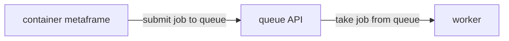

In remote mode, the worker connects to a cloud-hosted job queue. Jobs can be submitted from any browser — including mobile — and run on any machine with a worker connected to the same queue.



## Prerequisites

A Docker runtime:
- [OrbStack](https://orbstack.dev/) (recommended on macOS)
- [Docker Desktop](https://docs.docker.com/get-started/get-docker/)

## Run the worker

Get the command for your queue from [metapage.io/settings/queues](https://metapage.io/settings/queues), or run:

```bash
docker run --rm -it \
  -v /var/run/docker.sock:/var/run/docker.sock \
  -e METAPAGE_IO_WORKER_QUEUE=<your-queue-id> \
  metapage/metaframe-docker-worker:latest
```

The worker connects to the queue API at `container.mtfm.io`, takes jobs, runs them locally, and posts results back.

## Private queues

Create a private queue at [metapage.io/settings/queues](https://metapage.io/settings/queues). Share the queue ID with team members to let them connect their own workers — this creates an ad-hoc shared compute pool.

Multiple workers can connect to the same queue; jobs are distributed across all connected workers.

## Scaling

For automated scaling, see the [Fly.io deployment guide](/docs/container-provider-flyio), which covers autoscale-to-zero using Fly Autoscaler and Prometheus metrics from the queue API.

See [CLI reference](/docs/container-cli-reference) for all worker flags and environment variables.
