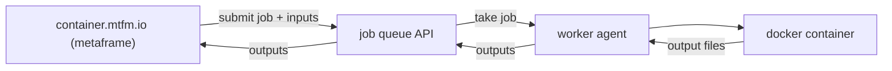

Container metaframes submit Docker jobs to a queue. Workers pick up and run the jobs, returning output files back to the workflow. This architecture decouples compute from the browser, while the metapage handles all data routing.



The queue ID is the access credential. Workers connect to a queue by ID; the metaframe URL specifies the same queue ID. Anyone with the queue ID can submit jobs to it.

Queue settings: [metapage.io/settings/queues](https://metapage.io/settings/queues)

## Public queue

A free shared queue (`public1`) is available with no configuration. It is subject to availability — there is no guarantee of capacity or uptime.

```
https://container.mtfm.io/#?queue=public1
```

## Private queues

Create a private queue at [metapage.io/settings/queues](https://metapage.io/settings/queues). Your queue ID is a random string — do not share it without consideration. Workers connect to it with:

```bash
# Command shown in the settings UI; also available via CLI
docker run ... METAPAGE_IO_WORKER_QUEUE=<your-queue-id> ...
```

## Worker modes

| Mode | When to use |
|---|---|
| [Local](/docs/container-local-mode) | Development, offline, or when data must not leave the machine |
| [Remote](/docs/container-remote-mode) | Team access, multi-machine scaling, mobile/tablet workflows |

## Deployment

| Option | Details |
|---|---|
| Local machine | [Local mode](/docs/container-local-mode) |
| Remote VM | [Remote mode](/docs/container-remote-mode) |
| Fly.io (autoscale) | [Fly.io deployment guide](/docs/container-provider-flyio) |

## GitHub

[`metapages/compute-queues`](https://github.com/metapages/compute-queues)
