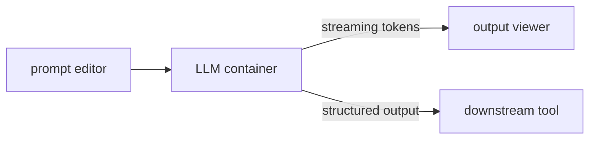

:::note
This example is in progress.
:::

An LLM inference pipeline with a prompt editor, container-side model inference, and a streaming output viewer.

## Planned architecture



## Components

- **Prompt editor** — a JavaScript metaframe (e.g. `editor.mtfm.io`) that emits the prompt as a named output
- **LLM container** — a Docker container running inference (Ollama, vllm, or similar); receives the prompt at `/inputs/prompt.txt`, writes response to `/outputs/response.txt`; optionally streams intermediate results via the [WebSocket channel](/docs/websocket-streaming)
- **Output viewer** — a JavaScript metaframe that renders the response, or a downstream container that processes structured output

## Key patterns

### Streaming progress via WebSocket

For long-running inference, the container can stream tokens in real time without waiting for the job to finish:

```python
import os, asyncio, websockets, json

async def stream_tokens(tokens):
    url = os.environ.get("WEBSOCKET_URL")
    async with websockets.connect(url) as ws:
        for token in tokens:
            await ws.send(json.dumps({"type": "token", "value": token}))
```

### Model caching

Use `$JOB_CACHE` to avoid re-downloading the model on every job:

```python
cache_dir = os.environ["JOB_CACHE"]
model_path = os.path.join(cache_dir, "llama3.gguf")

if not os.path.exists(model_path):
    download_model(model_path)
```

### Version-pinning the model container

Use [git refs in URLs](/docs/git-refs-in-urls) to pin the inference container to a specific commit:

```
https://github.com/myorg/llm-runner/tree/_model-version_
```

Then pass `?model-version=v2.1.0` in the metapage URL to pin to a release.
