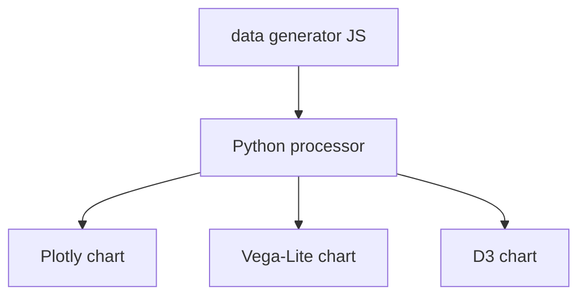

A workflow that chains multiple heterogeneous tools: a JavaScript data generator, a Python processing container, and three different visualization libraries rendering the same data in parallel.

<iframe
  scrolling="yes"
  allow="fullscreen *; camera *; speaker *;"
  style={{width:"100%", height:"700px", overflow:"hidden"}}
  src="https://metapage.io/dion/any-visualization-library/embed">
</iframe>

## Architecture



The same output data is fanned out to three independent visualization metaframes. Each renders independently; the layout is configured in `metapage.json`.

## metapage.json

```json
{
  "version": "2",
  "metaframes": {
    "generator": {
      "url": "https://random.mtfm.io/#?distribution=sin"
    },
    "processor": {
      "url": "https://container.mtfm.io/#?queue=<queue>&image=python:3.12-slim",
      "inputs": [
        { "metaframe": "generator", "source": "data", "target": "raw.json" }
      ]
    },
    "plotly": {
      "url": "https://plotly.mtfm.io/",
      "inputs": [
        { "metaframe": "processor", "source": "processed.json", "target": "data" }
      ]
    },
    "vega": {
      "url": "https://vega.mtfm.io/",
      "inputs": [
        { "metaframe": "processor", "source": "processed.json", "target": "data" }
      ]
    },
    "d3": {
      "url": "https://d3.mtfm.io/",
      "inputs": [
        { "metaframe": "processor", "source": "processed.json", "target": "data" }
      ]
    }
  }
}
```

## Key patterns

### Fan-out

A single output can be routed to multiple downstream metaframes by defining the same source in multiple `inputs` arrays. The routing layer sends a copy of each output to every subscribed target.

### Mixing JS and container metaframes

JavaScript metaframes and container metaframes operate on the same data model. JS frames pass data directly via `postMessage`; container frames pass files. The metapage routing layer handles the serialization transparently.

### Parallel rendering

Because each visualization metaframe is independent, they render in parallel. If one chart is slow to load, the others continue rendering unaffected.
