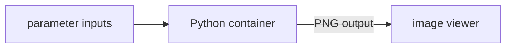

A Python data pipeline with an interactive visualization front-end. The workflow runs matplotlib in a container; the browser renders the output image in real time.

<iframe
  scrolling="yes"
  allow="fullscreen *; camera *; speaker *;"
  style={{width:"100%", height:"600px", overflow:"hidden"}}
  src="https://metapage.io/dion/python-matplotlib-dashboard/embed">
</iframe>

## How it works



1. The parameter metaframe emits JSON configuration as outputs
2. The Python container receives the config as `/inputs/config.json`, runs the computation, and writes a plot to `/outputs/plot.png`
3. The image viewer metaframe receives `plot.png` and displays it

## Container code

```python
# run.py — receives config.json, writes plot.png
import json, os
import matplotlib.pyplot as plt
import numpy as np

inputs_dir = os.environ["JOB_INPUTS"]
outputs_dir = os.environ["JOB_OUTPUTS"]

with open(os.path.join(inputs_dir, "config.json")) as f:
    config = json.load(f)

x = np.linspace(0, 2 * np.pi, config.get("points", 100))
y = np.sin(x * config.get("frequency", 1))

fig, ax = plt.subplots()
ax.plot(x, y)
ax.set_title(config.get("title", "Output"))

output_path = os.path.join(outputs_dir, "plot.png")
fig.savefig(output_path, dpi=150, bbox_inches="tight")
```

## Dockerfile

```dockerfile
FROM python:3.12-slim
RUN pip install matplotlib numpy
COPY run.py /app/run.py
CMD ["python", "/app/run.py"]
```

## metapage.json

```json
{
  "version": "2",
  "metaframes": {
    "params": {
      "url": "https://editor.mtfm.io/#?mode=json"
    },
    "compute": {
      "url": "https://container.mtfm.io/#?queue=<your-queue>&image=<your-image>",
      "inputs": [
        { "metaframe": "params", "source": "value", "target": "config.json" }
      ]
    },
    "viewer": {
      "url": "https://image.mtfm.io/",
      "inputs": [
        { "metaframe": "compute", "source": "plot.png", "target": "image" }
      ]
    }
  }
}
```

## Embedding in your application

```javascript
import { renderMetapage } from "@metapages/metapage";

const definition = await fetch("https://metapage.io/m/<id>/metapage.json").then(r => r.json());

const { setInputs } = await renderMetapage({
  definition,
  rootDiv: document.getElementById("dashboard"),
  onOutputs: (outputs) => {
    // Access outputs from any metaframe by key
    const plotUrl = outputs?.["compute"]?.["plot.png"];
  },
});

// Push configuration into the workflow programmatically
setInputs({ "params": { value: JSON.stringify({ frequency: 3, points: 200 }) } });
```
