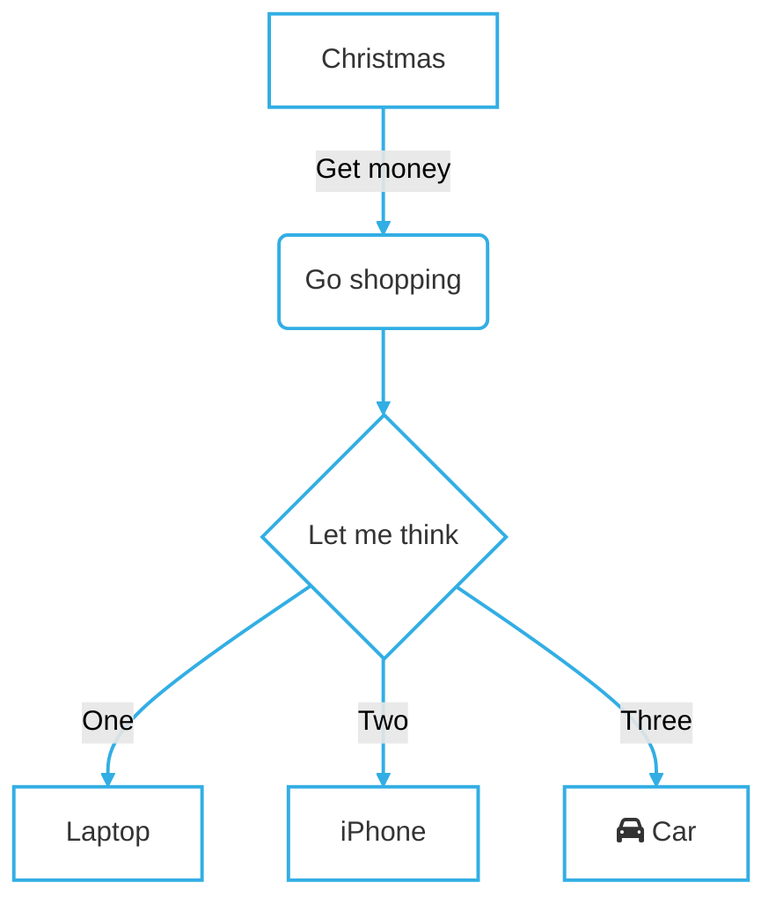

# The reference root

Something goes here

```mermaid
graph TD
  classDef default fill:#fff,stroke:#32AEE4,stroke-width:2px;
  linkStyle default stroke:#32AEE4,stroke-width:2px,color:black;
  A[Christmas] -->|Get money| B(Go shopping)
  B --> C{Let me think}
  C -->|One| D[Laptop]
  C -->|Two| E[iPhone]
  C -->|Three| F[fa:fa-car Car]
```
